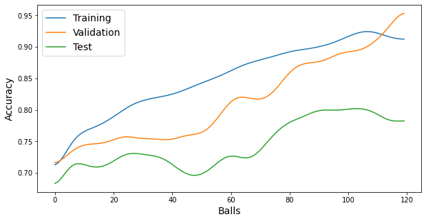
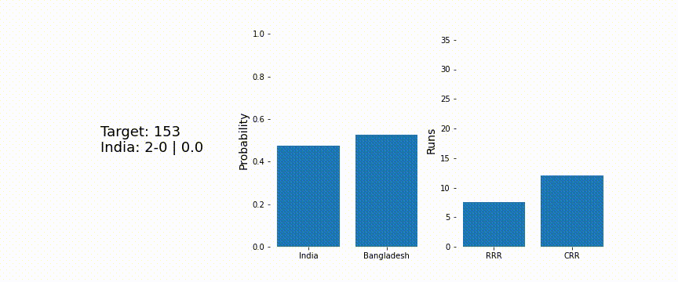
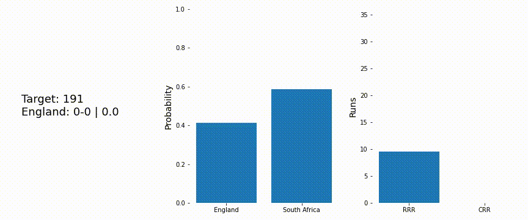

# Cricket Match Prediction
## Introduction
Predict match outcome for second inning of a T20 match. I took past T20 international matches dataset from [CRICSHEET](https://cricsheet.org/) and trained a deep neural network to give winning probability of teams after each ball of the game. 

## Dataset
Dataset was collected from the [CRICSHEET](https://cricsheet.org/) webiste. Cricsheet provides access to ball by ball data fro men and women Test matches, ODI, T20 internationals and all IPL seasons. The data is provided in YAML format. I took data for men T20 international matches, parsed it and generated a csv file with required attributes. We can take ODI dataset and run the same model with some changes.

## Data Preprocessing
For each ball in a match a feature of ['team-batting', 'team-bowling', 'wicket-left', 'runs-scored', 'target-score', 'balls-bowled',
'batsman-score', 'nonstriker-score', 'batsman-balls-faced', 'nonstriker-balls-faced'] is created. And feature of a match will be a collection of the feature corresponding to each ball in the match. Match's feature is fed to model for training and prediction.

## Training
An LSTM neural network model is used for training. 

## Results

# Simulation on Test Data
India vs Bengladesh: 2019-11-07 | Winner: India

England vs South Africa: 2020-12-01 | Winner: England

